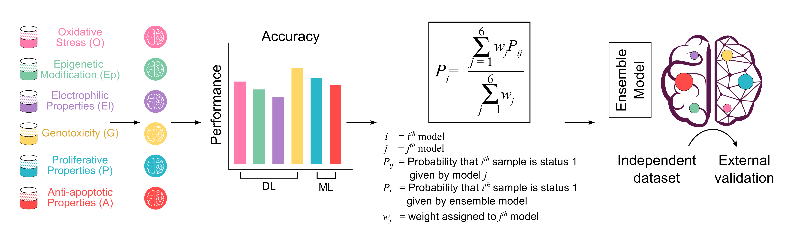

# Metabokiller: Artificial Intelligence uncovers carcinogenic human metabolites

 
 

How to use Metabokiller?<!-- cover image -->

To get predictions for your data:
 In your drive, download the models folder.
 Run the MetaboKiller_ensemble.ipynb notebook.
 Give your input file as input.csv consisting of name and smiles of the compounds you want to predict.
